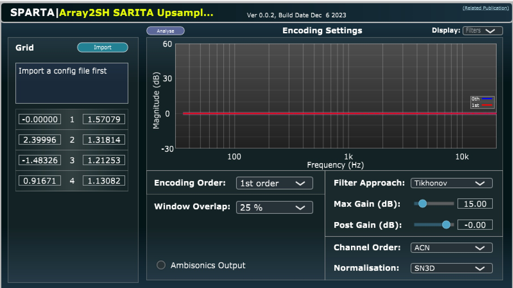

# Spatial Array Interpolation by Time Alignment (SARITA) real-time
VST implementation of SARITA algorithm [1, 2], build upon the [SPARTA](https://github.com/leomccormack/SPARTA) array2sh plugin [3] in [JUCE](https://github.com/WeAreROLI/JUCE/).

* [1] Luebeck, T., Arend, J.M., and Poaerschmann, C. 2023 [**Spatial Upsampling of Sparse Spherical Microphone Array Signals**]. IEEE/ACM   Transactions on Audio Speech and Language Processing
* [2] Poerschmann C., Luebeck T. Arend, J.M. 2024 [**Time-aligned spatial upsampling of spherical microphone array recordings**]. Journal of the Audio Engineering Society
* [3] McCormack, L. and Politis, A. 2019. [**SPARTA & COMPASS: Real-time implementations of linear and parametric spatial audio reproduction and processing methods**](docs/McCormackPolitis2019SpartaCompass.pdf). In Audio Engineering Society Conference: 2019 AES International Conference on Immersive and Interactive Audio.

## Description
Real-time implementation of the SARITA upsampling algorithm described in [1] and [2].

## Building 

Follow exactly the instructions of the original SPARTA plugin suite.

MKL: https://www.intel.com/content/www/us/en/developer/tools/oneapi/onemkl-download.html

## Using
Create config using MATLAB script 'DEMO_generate_config_for_vst.m' from https://github.com/AudioGroupCologne/SARITA
## Contributors 

* **Gary Grutzek** - C/C++ programmer and algorithm design
* **Tim Luebeck** - algorithm design
* **Christoph Poerschmann** -  algorithm design
* **Johannes M. Arend** - algorithm design

contact : christoph.poerschmann@th-koeln.de

## License

This project is provided under the GPLv3 License - see the [LICENSE](LICENSE) file for details. 
